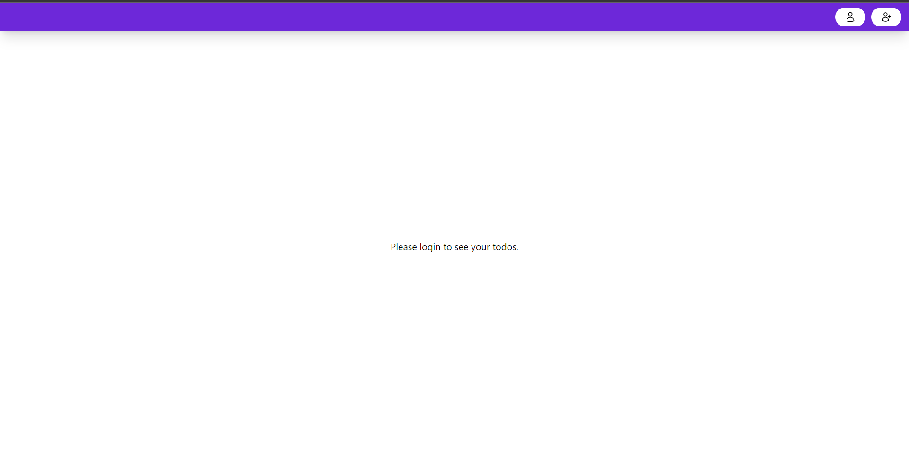
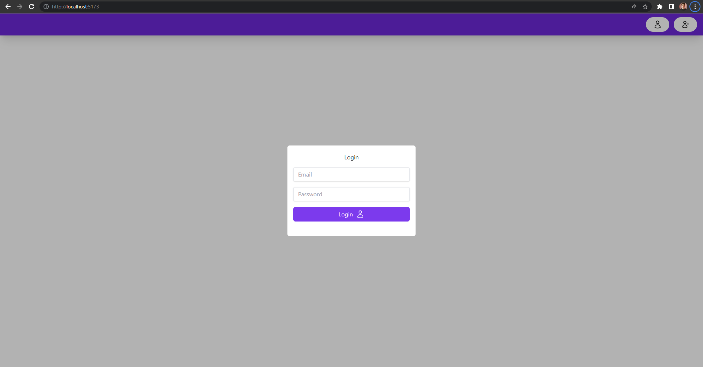
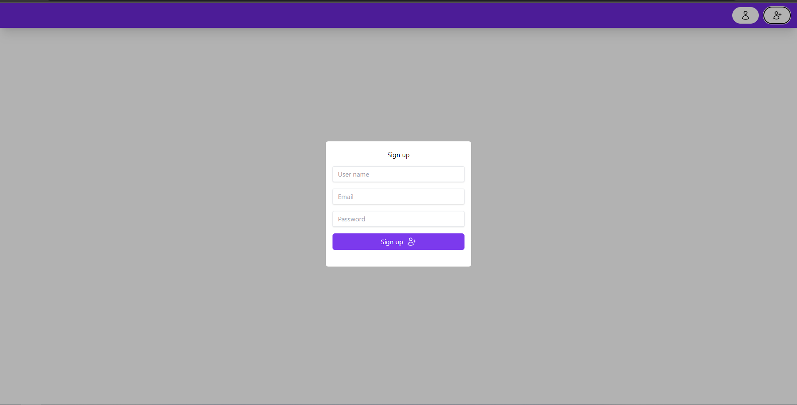
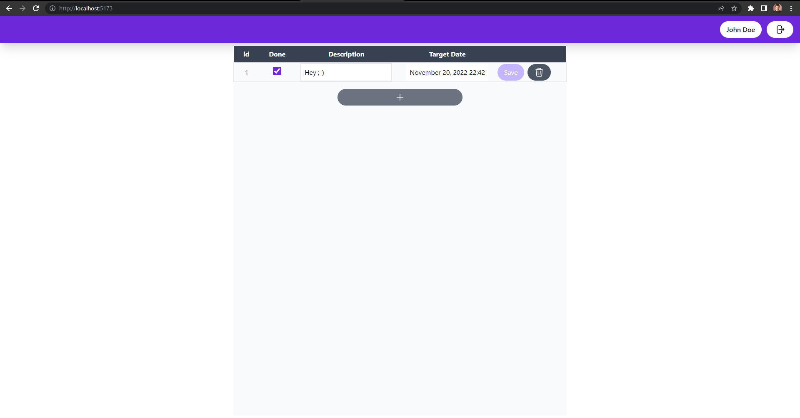

## graphql-todo
This is a small todo application for which the main goal is to implement CRUD operations using [GraphQL.](https://graphql.org/)

`Note`: Back-end and Front-end both use [TypeScript](https://www.typescriptlang.org/) as the programming language.

### Client functionalities
1. GrapQL API integration using the [Apollo React Client.](https://www.apollographql.com/docs/react/)
2. State management with [Zustand](https://github.com/pmndrs/zustand)
3. Form management with [Formik](https://formik.org/)
4. UI Components with [Tailwind](https://tailwindcss.com/)

### Server functionalities
1. GraphQL API with [GraphQL Nexus](https://nexusjs.org/)
2. Secure JWT Authentication / Authorization using HTTPOnly cookies.
3. DB Integration using the [Prisma ORM](https://www.prisma.io/)
4. Password Hashing with [bcrypt](https://www.npmjs.com/package/bcrypt)

### Setup
1. Clone the repository, open a new terminal at the newly cloned `graphql-todo` folder.
2. Install dependencies for both the client and the server:
```
  cd ./client
  
  npm install
  
  cd ../server
  
  npm install
```

### Running the app
1. Open two terminal instances at the `graphql-todo` folder.
2. Run the client in the first terminal instance:
```
  cd ./client
  npm run dev
```
3. Run the server in the second terminal instance:
```
  cd ./server
  npm run dev
```
4. If all went well, the client is now serving at `http://localhost:5173/` and server is serving at `http://localhost:4000/graphql/`

### Previews




